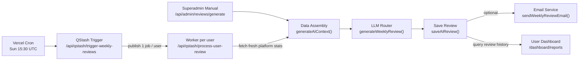
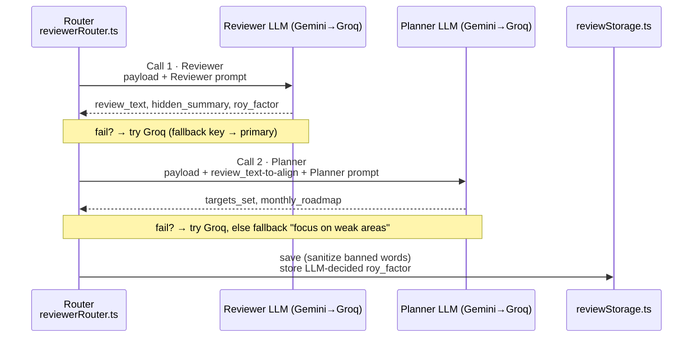
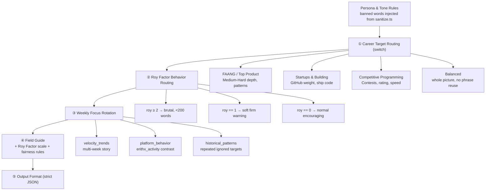
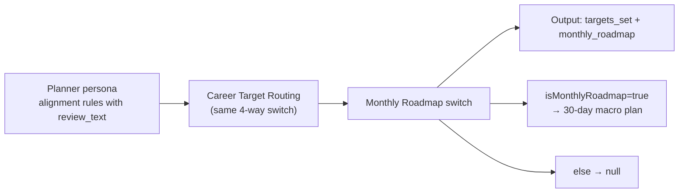
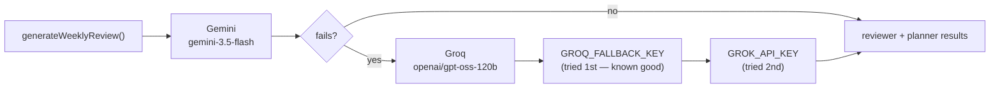
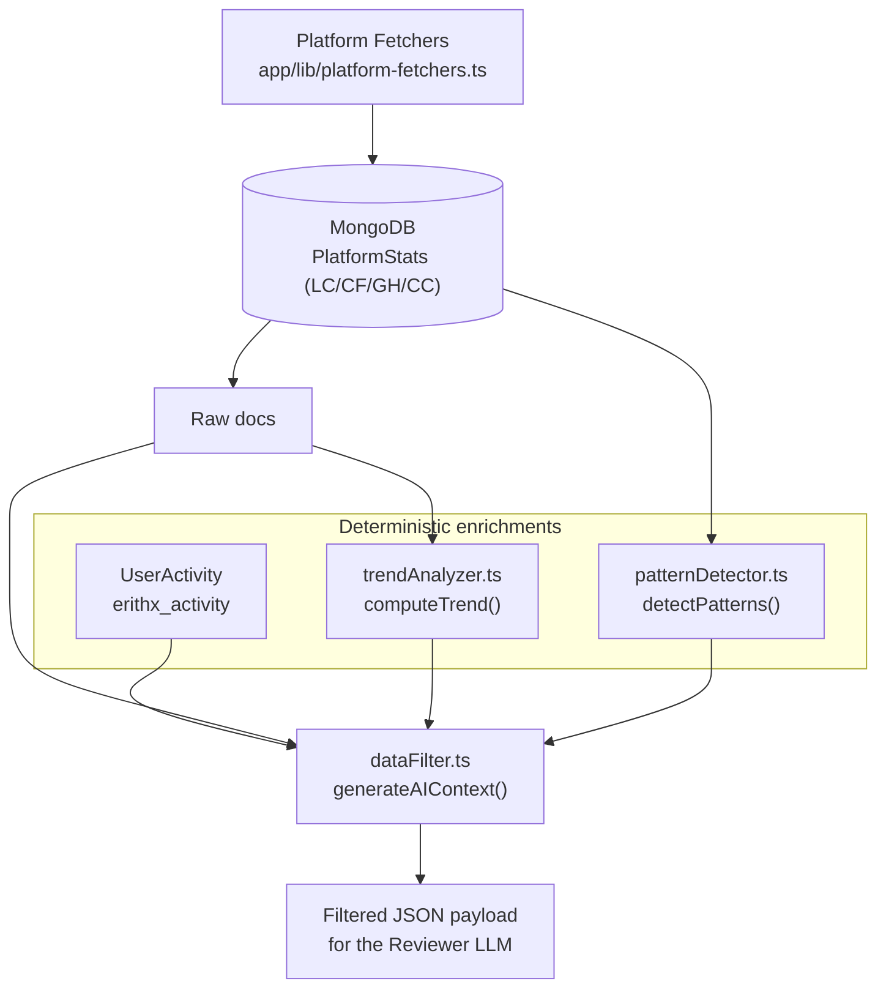
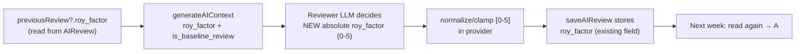
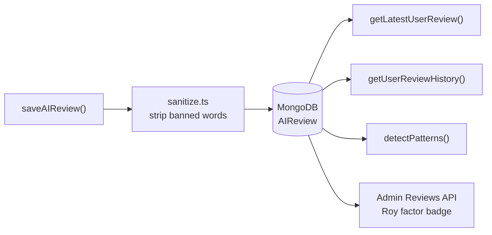

# Product Architecture — ErithX Weekly AI Review System

> High-level, visual guide to how the Weekly Review system is wired together:
> the Reviewer↔Planner LLM flow, prompt divisions, provider fallback, data assembly,
> storage, and scheduling. Intentionally high-level — trace the boxes, not the code.

---

## 1. End-to-End Flow (Trigger → Email)

---

## 2. The Core: Reviewer + Planner are TWO SEPARATE LLM Calls

Every review = **2 independent LLM calls in series**. They are intentionally **not** one call —
the buddy already tested this: *"Reviewer → Planner split"* gives clean alignment where the Planner's
targets always match the Reviewer's tone.

- **Serial dependency** (Planner needs Reviewer text) is deliberate — it guarantees tone/goal alignment.
- Fallback for planner failure is a harmless default target so a Planner hiccup never kills a review.

---

## 3. Prompt Divisions (all inside `services/ai/prompts.ts`)

### 3a. Reviewer prompt — `getReviewerPrompt(careerTarget, royFactor, weeklyFocus)`

### 3b. Planner prompt — `getPlannerPrompt(careerTarget, isMonthlyRoadmap)`

---

## 4. Provider Fallback Chain (Gemini first, Groq on failure)

Notes:
- Two separate fallbacks: one for Reviewer, one for Planner.
- **429 rate-limit retry** on Gemini: back off and retry (free-tier ~5 req/min/model).
- Groq tries `GROQ_FALLBACK_KEY` first (the primary `GROK_API_KEY` is currently dead → avoids 3-5s of latency).

---

## 5. Data Assembly Layer (`services/core/`)

**What `dataFilter.ts` computes (math only, LLM interprets):**
- Per-platform metrics: deltas, ratings, active days, weekly solves (`problems_solved_this_week`, `contests_entered_this_week`).
- `calculations.overall_progress_score` (0-100) — a bare number, never labeled.
- `degrade_report.severity` — talking points, not verdicts.
- `trend_3_weeks` arrays via `trendAnalyzer` (`[8, 14, 5]` style, chronological).
- `historical_patterns` via `patternDetector` (compliance trajectory + all past targets).
- `review_focus_this_week` rotation (velocity_trends → platform_behavior → historical_patterns).
- `is_baseline_review` guard for first-ever reviews.

---

## 6. Roy Factor Lifecycle (LLM-decided, no migration)

- **New-user edge case:** `isBaselineReview: true` (or no `previous_recommendation`) ⇒ prompt **forces** `roy_factor: 0`.
  A brand-new user can't "ignore" a target that never existed — no unfair first-review escalation.
- Recovery case: improving users go *down*, never up.
- **No DB migration** — `roy_factor` already exists on `AIReview`. Only additive Mongoose schema fields
  (e.g. `contestId` in Codeforces submissions) are used, which Mongo tolerates automatically.

---

## 7. Storage Layer

- `generated_text`, `targets_set`, `monthly_roadmap`, `hidden_summary`, `roy_factor`, `stats_snapshot`, `admin_note`, `email_sent`.
- Sanitizer is the **safety net** for banners that slip from providers (Bug 5) — applied right before the document is written.

---

## 8. Key Files at a Glance

| Layer | File |
|---|---|
| Router / orchestration | `services/ai/reviewerRouter.ts` |
| Prompts (reviewer + planner) | `services/ai/prompts.ts` |
| Banned-word guard | `services/ai/sanitize.ts` |
| Providers (Gemini / Groq / NIM) | `services/ai/providers/callGemini.ts`, `callLlama.ts`, `callNemotron.ts` |
| Persistence | `services/ai/reviewStorage.ts`, `models/AIReview.ts` |
| Context assembly | `services/core/dataFilter.ts`, `trendAnalyzer.ts`, `patternDetector.ts` |
| Triggers | `app/api/qstash/trigger-weekly-reviews/route.ts`, `app/api/qstash/process-user-review/route.ts`, `app/api/admin/reviews/generate/route.ts` |
| Platform ingestion | `app/lib/platform-fetchers.ts`, `models/PlatformStats.ts` |