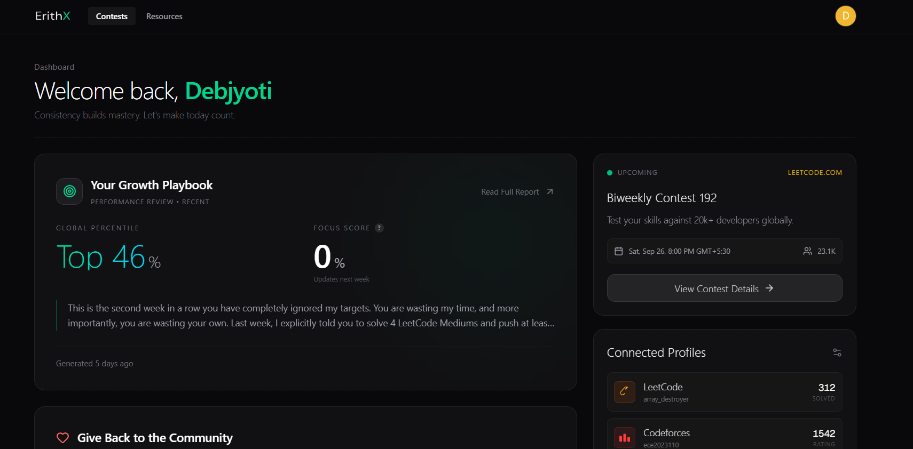
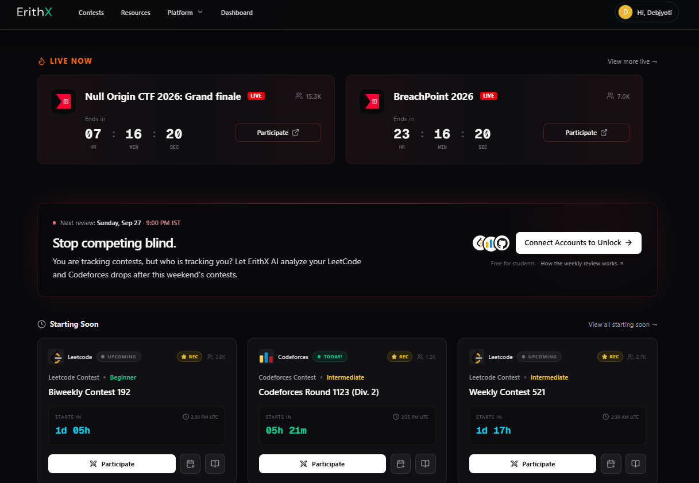
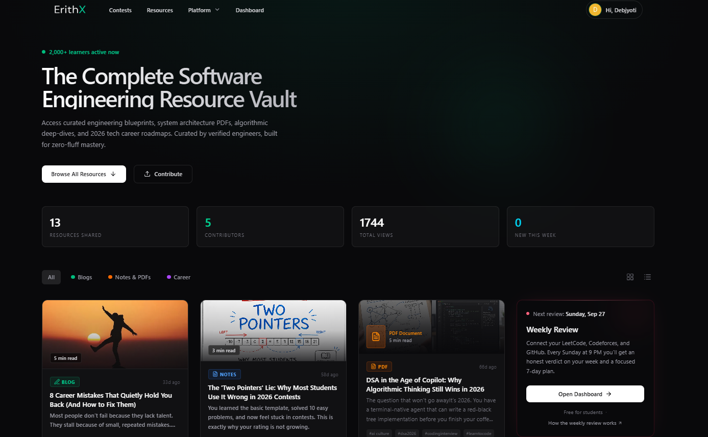
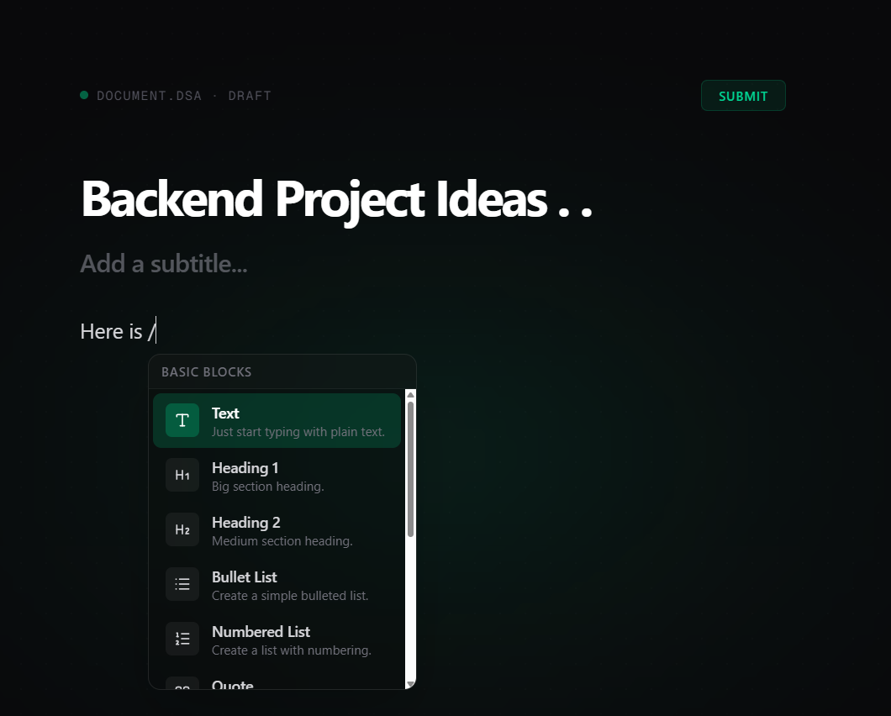
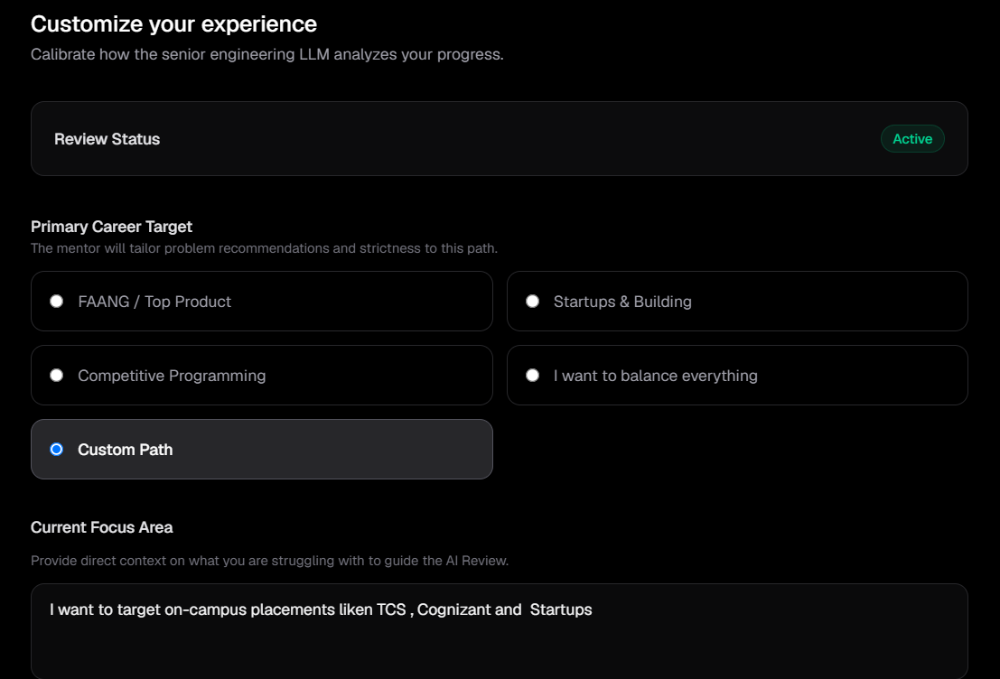
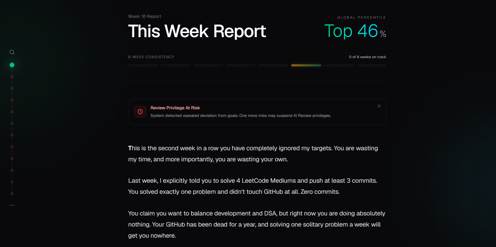

# ErithX — Contest Calendar + Placement Prep Platform

[](./LICENSE)
[](https://github.com/ErithX/ErithX/stargazers)
[](https://github.com/ErithX/ErithX/network/members)
[](https://github.com/ErithX/ErithX/issues)
[](https://github.com/ErithX/ErithX/commits/main)
[](https://erithx.dev)
[](https://nextjs.org/)
[](https://www.typescriptlang.org/)
[](https://supabase.com/)

> Stop juggling multiple coding platforms. Track contests, monitor consistency, and turn your competitive programming and dev activity into a weekly growth plan.

Live app: https://erithx.dev  
Docs: https://erithx.dev/docs  
Features: https://erithx.dev/features

---

## Product overview

ErithX is a smart engineering growth platform built for students and developers who take competitive programming and placements seriously.

It connects the signals that matter most across your coding journey:

- contest participation across Codeforces, LeetCode, CodeChef, AtCoder, HackerRank, and more
- coding profile activity from GitHub, LeetCode, and Codeforces
- weekly system-powered review of performance, consistency, and weak areas
- placement-focused learning resources, notes, and curated engineering resources
- email alerts and calendar sync to keep you on track without missing important rounds

The platform is designed to help users move from “random practice” to a structured growth system with measurable momentum.

---

## Product flow

ErithX follows a simple loop:

1. Connect profiles
   - Link your LeetCode, Codeforces, and GitHub profiles
   - Confirm your coding identities and activity sources
2. Track contests and momentum
   - See upcoming and live contests in one place
   - Add them to Google Calendar or Apple Calendar with one click
   - Get reminders before competitions start
3. Review performance weekly
   - Receive honest system-generated feedback
   - Understand strengths, weak areas, and streak consistency
   - Get a 7-day action plan tailored to your current progress
4. Learn and improve
   - Discover curated engineering notes, blogs, PDFs, and resources
   - Publish and share useful resources with the community

---

## Platform preview

<div align="center">
  <video src="https://github.com/ErithX/ErithX/raw/main/Assets/Product%20GIF.mp4" autoplay loop muted playsinline width="100%"></video>
</div>

### Product Overview

<table>
  <tr>
    <td width="50%" valign="top" align="center">
      <a href="./Assets/Dashboard.png"></a>
      <br><b>User Dashboard</b><br>
      <sub>Track growth, percentile ranking, focus score, and critique.</sub>
    </td>
    <td width="50%" valign="top" align="center">
      <a href="./Assets/Contests.png"></a>
      <br><b>Contests Dashboard</b><br>
      <sub>Live and upcoming rounds with countdowns and alerts.</sub>
    </td>
  </tr>
  <tr>
    <td width="50%" valign="top" align="center">
      <a href="./Assets/Articles.png"></a>
      <br><b>Resource Vault</b><br>
      <sub>Engineering resource hub with shared statistics and filters.</sub>
    </td>
    <td width="50%" valign="top" align="center">
      <a href="./Assets/Write.png"></a>
      <br><b>Resource Editor</b><br>
      <sub>Rich text publishing flow for submitting study material.</sub>
    </td>
  </tr>
</table>

### The User Journey

<div align="center">

  <!-- STEP 1 -->
  <a href="./Assets/SIgn%20up.png"></a>
  <br><b>1. Onboarding</b><br>
  <sub>Clean sign-in flow with role-based onboarding and Google OAuth.</sub>
  <br><br>
  
  <br><br>

  <!-- STEP 2 -->
  <a href="./Assets/Customization.png"></a>
  <br><b>2. Personalization</b><br>
  <sub>Customize the reviewer to match your target career path.</sub>
  <br><br>
  
  <br><br>

  <!-- STEP 3 -->
  <a href="./Assets/Coding%20profiles.png"></a>
  <br><b>3. Connect Profiles</b><br>
  <sub>Link LeetCode, GitHub, and Codeforces for verification.</sub>
  <br><br>
  
  <br><br>

  <!-- STEP 4 -->
  <a href="./Assets/Email%20alert%20+%20calender.png"></a>
  <br><b>4. Sync &amp; Alerts</b><br>
  <sub>One-click calendar sync and email notifications.</sub>
  <br><br>
  
  <br><br>

  <!-- STEP 5 -->
  <a href="./Assets/Report.png"></a>
  <br><b>5. Automated Weekly Review</b><br>
  <sub>Candid weekly report with performance trends and feedback.</sub>

</div>

---

## Why ErithX matters

ErithX is built for the reality of competitive programming and placement prep:

- students are juggling multiple platforms
- contest schedules are fragmented across services
- performance feedback is inconsistent or absent
- preparation is harder without a long-term system

The platform brings those workflows into one place so progress becomes easier to track and act on.

---

## Key features

### Contest synchronization

- aggregate contests from multiple platforms
- local timezone conversion
- Google Calendar / Apple Calendar support
- upcoming and live contest tracking

### Weekly automated review

- connect public coding profiles
- review consistency, strength, and weak spots
- generate 7-day improvement plans
- make performance analysis actionable, not generic

### Resource vault

- curated engineering resources and study material
- notes, PDFs, blogs, and career-focused content
- share-ready publishing workflow for contributors

### Smart alerts

- contest reminders
- weekly digest summaries
- user-specific performance nudges

---

## Technology stack

[](https://nextjs.org/)
[](https://www.typescriptlang.org/)
[](https://tailwindcss.com/)
[](https://supabase.com/)
[](https://vercel.com/)
[](./LICENSE)

- Frontend: Next.js 16 + TypeScript + Tailwind CSS
- Backend: Supabase
- Deployment: Vercel
- Integrations: LeetCode, Codeforces, CodeChef, AtCoder, HackerRank, GeeksforGeeks, GitHub
- Alerts: automated email and reminder flow

---

## Quick start

### For users

1. Visit https://erithx.dev
2. Sign in with Google
3. Connect your competitive programming and developer profiles
4. Review upcoming contests and your weekly growth report
5. Use calendar sync and notifications to stay consistent

### For developers

```bash
# Clone the repository
git clone https://github.com/ErithX/ErithX.git
cd ErithX

# Install dependencies
npm install

# Create environment file
cp .env.example .env.local

# Start the app
npm run dev
```

Then open http://localhost:3000

Requirements:

- Node.js 18+
- Supabase account
- Google OAuth setup
- Email service credentials

---

## Documentation

- [Docs Hub](https://erithx.dev/docs)
- [Performance Analysis](https://erithx.dev/docs/performance-analysis)
- [Contest Tracker Guide](https://erithx.dev/docs/contest-tracker)
- [Creator Studio](https://erithx.dev/docs/creator-studio)
- [Notifications](https://erithx.dev/docs/notifications)
- [FAQ](https://erithx.dev/faq)

---

## Security and privacy

- Public profile data only
- No password storage for platform-linked account access
- OAuth-based authentication
- Responsible disclosure process available via SECURITY.md

---

## Contributing

We welcome community contributions across bug reports, features, UI refinements, and documentation.

To contribute:

1. Fork the repository
2. Create a feature branch
3. Make a focused change
4. Run lint and validation checks
5. Open a PR with a clear summary

See [CONTRIBUTING.md](./CONTRIBUTING.md) for the full contributor guide.

---

## Support

- [Contact Us](https://erithx.dev/contact)
- [GitHub Issues](https://github.com/ErithX/ErithX/issues)
- [Security Policy](./SECURITY.md)

---

## License

This project is licensed under the MIT License. See [LICENSE](./LICENSE).

---

Made for engineering students, competitive programmers, and builders who want better structure and better growth.
